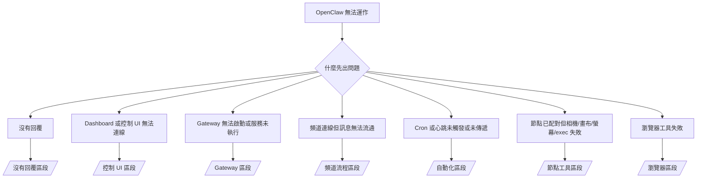

# 疑難排解

如果您只有 2 分鐘，請以此頁面作為分類的前門。

## 前 60 秒

按順序執行這個梯狀排查：

```bash
openclaw status
openclaw status --all
openclaw gateway probe
openclaw gateway status
openclaw doctor
openclaw channels status --probe
openclaw logs --follow
```

一行好輸出：

- `openclaw status` → 顯示已設定的頻道且沒有明顯的認證錯誤。
- `openclaw status --all` → 完整報告存在且可分享。
- `openclaw gateway probe` → 預期的 gateway 目標可到達。
- `openclaw gateway status` → `Runtime: running` 且 `RPC probe: ok`。
- `openclaw doctor` → 沒有封鎖的設定/服務錯誤。
- `openclaw channels status --probe` → 頻道報告 `connected` 或 `ready`。
- `openclaw logs --follow` → 穩定活動，沒有重複的致命錯誤。

## Anthropic 長上下文 429

如果您看到：
`HTTP 429: rate_limit_error: Extra usage is required for long context requests`，
請前往 [/gateway/troubleshooting#anthropic-429-extra-usage-required-for-long-context](/zh-Hant/gateway/troubleshooting#anthropic-429-extra-usage-required-for-long-context)。

## 外掛安裝因缺少 openclaw extensions 而失敗

如果安裝失敗，出現 `package.json missing openclaw.extensions`，表示外掛套件使用了 OpenClaw 不再接受的舊格式。

在外掛套件中修復：

1. 在 `package.json` 中加入 `openclaw.extensions`。
2. 將條目指向建置後的執行階段檔案（通常是 `./dist/index.js`）。
3. 重新發布外掛並再次執行 `openclaw plugins install <npm-spec>`。

範例：

```json
{
  "name": "@openclaw/my-plugin",
  "version": "1.2.3",
  "openclaw": {
    "extensions": ["./dist/index.js"]
  }
}
```

參考：[/tools/plugin#distribution-npm](/zh-Hant/tools/plugin#distribution-npm)

## 決策樹



<AccordionGroup>
  <Accordion title="沒有回覆">
    ```bash
    openclaw status
    openclaw gateway status
    openclaw channels status --probe
    openclaw pairing list --channel <channel> [--account <id>]
    openclaw logs --follow
    ```

    好的輸出看起來像：

    - `Runtime: running`
    - `RPC probe: ok`
    - 您的頻道在 `channels status --probe` 中顯示已連線/就緒
    - 傳送者顯示為已核准（或 DM 政策為開放/允許清單）

    常見的日誌特徵：

    - `drop guild message (mention required` → 提及閘控在 Discord 中封鎖了訊息。
    - `pairing request` → 傳送者未核准且正在等待 DM 配對核准。
    - 頻道日誌中的 `blocked` / `allowlist` → 傳送者、房間或群組被過濾。

    深入頁面：

    - [/gateway/troubleshooting#no-replies](/zh-Hant/gateway/troubleshooting#no-replies)
    - [/channels/troubleshooting](/zh-Hant/channels/troubleshooting)
    - [/channels/pairing](/zh-Hant/channels/pairing)

  </Accordion>

  <Accordion title="Dashboard 或控制 UI 無法連線">
    ```bash
    openclaw status
    openclaw gateway status
    openclaw logs --follow
    openclaw doctor
    openclaw channels status --probe
    ```

    好的輸出看起來像：

    - `openclaw gateway status` 中顯示 `Dashboard: http://...`
    - `RPC probe: ok`
    - 日誌中沒有認證迴圈

    常見的日誌特徵：

    - `device identity required` → HTTP/非安全上下文無法完成裝置認證。
    - `unauthorized` / 重新連線迴圈 → 錯誤的 token/密碼或認證模式不符。
    - `gateway connect failed:` → UI 目標為錯誤的 URL/連接埠或無法到達的 gateway。

    深入頁面：

    - [/gateway/troubleshooting#dashboard-control-ui-connectivity](/zh-Hant/gateway/troubleshooting#dashboard-control-ui-connectivity)
    - [/web/control-ui](/zh-Hant/web/control-ui)
    - [/gateway/authentication](/zh-Hant/gateway/authentication)

  </Accordion>

  <Accordion title="Gateway 無法啟動或服務已安裝但未執行">
    ```bash
    openclaw status
    openclaw gateway status
    openclaw logs --follow
    openclaw doctor
    openclaw channels status --probe
    ```

    好的輸出看起來像：

    - `Service: ... (loaded)`
    - `Runtime: running`
    - `RPC probe: ok`

    常見的日誌特徵：

    - `Gateway start blocked: set gateway.mode=local` → gateway 模式未設定/為遠端。
    - `refusing to bind gateway ... without auth` → 沒有 token/密碼的非環回綁定。
    - `another gateway instance is already listening` 或 `EADDRINUSE` → 連接埠已被占用。

    深入頁面：

    - [/gateway/troubleshooting#gateway-service-not-running](/zh-Hant/gateway/troubleshooting#gateway-service-not-running)
    - [/gateway/background-process](/zh-Hant/gateway/background-process)
    - [/gateway/configuration](/zh-Hant/gateway/configuration)

  </Accordion>

  <Accordion title="頻道連線但訊息無法流通">
    ```bash
    openclaw status
    openclaw gateway status
    openclaw logs --follow
    openclaw doctor
    openclaw channels status --probe
    ```

    好的輸出看起來像：

    - 頻道傳輸已連線。
    - 配對/允許清單檢查通過。
    - 必要時偵測到提及。

    常見的日誌特徵：

    - `mention required` → 群組提及閘控封鎖了處理。
    - `pairing` / `pending` → DM 傳送者尚未核准。
    - `not_in_channel`、`missing_scope`、`Forbidden`、`401/403` → 頻道權限/token 問題。

    深入頁面：

    - [/gateway/troubleshooting#channel-connected-messages-not-flowing](/zh-Hant/gateway/troubleshooting#channel-connected-messages-not-flowing)
    - [/channels/troubleshooting](/zh-Hant/channels/troubleshooting)

  </Accordion>

  <Accordion title="Cron 或心跳未觸發或未傳遞">
    ```bash
    openclaw status
    openclaw gateway status
    openclaw cron status
    openclaw cron list
    openclaw cron runs --id <jobId> --limit 20
    openclaw logs --follow
    ```

    好的輸出看起來像：

    - `cron.status` 顯示已啟用且有下次喚醒時間。
    - `cron runs` 顯示最近的 `ok` 條目。
    - 心跳已啟用且不在活動時間外。

    常見的日誌特徵：

    - `cron: scheduler disabled; jobs will not run automatically` → cron 已停用。
    - `heartbeat skipped` 含 `reason=quiet-hours` → 在設定的活動時間外。
    - `requests-in-flight` → 主通道繁忙；心跳喚醒被延遲。
    - `unknown accountId` → 心跳傳遞目標帳號不存在。

    深入頁面：

    - [/gateway/troubleshooting#cron-and-heartbeat-delivery](/zh-Hant/gateway/troubleshooting#cron-and-heartbeat-delivery)
    - [/automation/troubleshooting](/zh-Hant/automation/troubleshooting)
    - [/gateway/heartbeat](/zh-Hant/gateway/heartbeat)

  </Accordion>

  <Accordion title="節點已配對但工具失敗（相機/畫布/螢幕/exec）">
    ```bash
    openclaw status
    openclaw gateway status
    openclaw nodes status
    openclaw nodes describe --node <idOrNameOrIp>
    openclaw logs --follow
    ```

    好的輸出看起來像：

    - 節點列為已連線且以 `node` 角色配對。
    - 您呼叫的命令存在對應的能力。
    - 工具的權限狀態已授予。

    常見的日誌特徵：

    - `NODE_BACKGROUND_UNAVAILABLE` → 將節點應用程式帶至前景。
    - `*_PERMISSION_REQUIRED` → 作業系統權限被拒/缺少。
    - `SYSTEM_RUN_DENIED: approval required` → exec 核准正在等待中。
    - `SYSTEM_RUN_DENIED: allowlist miss` → 命令不在 exec 允許清單上。

    深入頁面：

    - [/gateway/troubleshooting#node-paired-tool-fails](/zh-Hant/gateway/troubleshooting#node-paired-tool-fails)
    - [/nodes/troubleshooting](/zh-Hant/nodes/troubleshooting)
    - [/tools/exec-approvals](/zh-Hant/tools/exec-approvals)

  </Accordion>

  <Accordion title="瀏覽器工具失敗">
    ```bash
    openclaw status
    openclaw gateway status
    openclaw browser status
    openclaw logs --follow
    openclaw doctor
    ```

    好的輸出看起來像：

    - 瀏覽器狀態顯示 `running: true` 且有選定的瀏覽器/設定檔。
    - `openclaw` 設定檔啟動或 `chrome` 中繼有已附加的分頁。

    常見的日誌特徵：

    - `Failed to start Chrome CDP on port` → 本地瀏覽器啟動失敗。
    - `browser.executablePath not found` → 設定的二進位路徑錯誤。
    - `Chrome extension relay is running, but no tab is connected` → 擴充功能未附加。
    - `Browser attachOnly is enabled ... not reachable` → attach-only 設定檔沒有存活的 CDP 目標。

    深入頁面：

    - [/gateway/troubleshooting#browser-tool-fails](/zh-Hant/gateway/troubleshooting#browser-tool-fails)
    - [/tools/browser-linux-troubleshooting](/zh-Hant/tools/browser-linux-troubleshooting)
    - [/tools/browser-wsl2-windows-remote-cdp-troubleshooting](/zh-Hant/tools/browser-wsl2-windows-remote-cdp-troubleshooting)
    - [/tools/chrome-extension](/zh-Hant/tools/chrome-extension)

  </Accordion>
</AccordionGroup>
