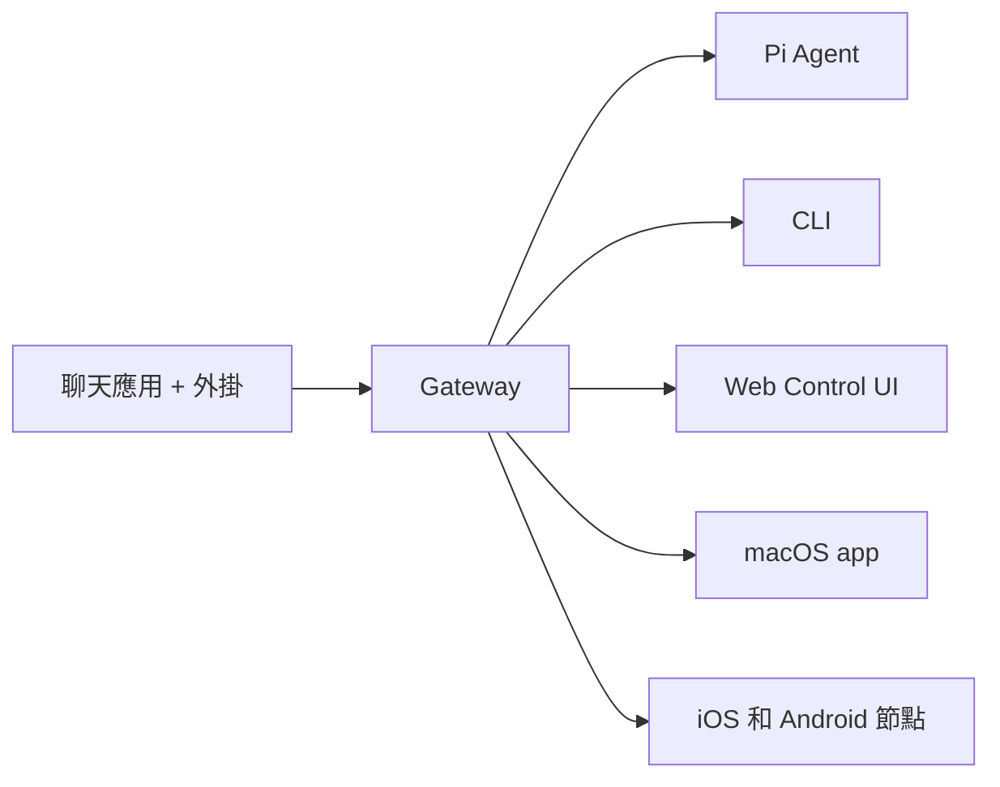

# OpenClaw 🦞

<p align="center">
    
    
</p>

> _"脫皮！脫皮！"_ — 可能是一隻太空龍蝦

<p align="center">
  <strong>任何作業系統的 Gateway，適用於跨 WhatsApp、Telegram、Discord、iMessage 等的 AI Agent。</strong><br />
  傳送訊息，從你的口袋取得 Agent 回應。外掛程式新增 Mattermost 等。
</p>

<Warning>
**非官方翻譯聲明**

這個中文網站是由 **[陳泰呈（Jackle）](https://www.facebook.com/jackle45/)** 因為自己要研究而順手翻譯的。未來不一定會即時更新，也不保證翻譯內容的正確性，純粹就是分享。如需最新且正確的資訊，請參考 [官方英文文件](https://docs.openclaw.ai)。

**對應版本：`v2026.3.12`** · 翻譯更新日期：2026-03-13

<CardGroup cols={3}>
  <Card title="Jackle 部落格" href="https://jackle.pro/about" icon="globe">
    jackle.pro
  </Card>
  <Card title="Facebook" href="https://www.facebook.com/jackle45/" icon="facebook">
    @jackle45
  </Card>
  <Card title="Threads" href="https://www.threads.com/@jackle9527" icon="at-sign">
    @jackle9527
  </Card>
</CardGroup>
</Warning>

<Columns>
  <Card title="開始使用" href="/zh-Hant/start/getting-started" icon="rocket">
    在幾分鐘內安裝 OpenClaw 並啟動 Gateway。
  </Card>
  <Card title="執行精靈" href="/zh-Hant/start/wizard" icon="sparkles">
    使用 `openclaw onboard` 和配對流程的引導設定。
  </Card>
  <Card title="開啟 Control UI" href="/zh-Hant/web/control-ui" icon="layout-dashboard">
    啟動瀏覽器儀表板以進行聊天、設定和會話。
  </Card>
</Columns>

## 什麼是 OpenClaw？

OpenClaw 是一個**自我託管的 Gateway**，將你最喜歡的聊天應用程式 — WhatsApp、Telegram、Discord、iMessage 等 — 連接到 AI 編碼 Agent，例如 Pi。你在自己的機器（或伺服器）上執行單個 Gateway 進程，它成為你的訊息應用程式和始終可用的 AI 助手之間的橋樑。

**誰適合使用？** 開發人員和進階使用者，他們希望擁有可以從任何地方訊息的個人 AI 助手 — 而不放棄對其資料的控制或依賴託管服務。

**有什麼不同之處？**

- **自我託管**：在你的硬體上執行，你的規則
- **多頻道**：一個 Gateway 同時服務 WhatsApp、Telegram、Discord 等
- **Agent 原生**：為編碼 Agent 設計，具有工具使用、會話、記憶和多 Agent 路由
- **開源**：MIT 授權，社群驅動

**你需要什麼？** Node 22+、你選擇的提供者 API 金鑰和 5 分鐘。為了最佳品質和安全性，請使用可用的最強最新一代模型。

## 它的運作方式



Gateway 是會話、路由和頻道連接的單一事實來源。

## 主要功能

<Columns>
  <Card title="多頻道 Gateway" icon="network">
    WhatsApp、Telegram、Discord 和 iMessage 搭配單一 Gateway 進程。
  </Card>
  <Card title="外掛程式頻道" icon="plug">
    使用擴充套件套件新增 Mattermost 等。
  </Card>
  <Card title="多 Agent 路由" icon="route">
    每個 Agent、工作區或寄件者的隔離會話。
  </Card>
  <Card title="媒體支援" icon="image">
    傳送和接收影像、音訊和文件。
  </Card>
  <Card title="Web Control UI" icon="monitor">
    用於聊天、設定、會話和節點的瀏覽器儀表板。
  </Card>
  <Card title="行動節點" icon="smartphone">
    配對 iOS 和 Android 節點，支援 Canvas、相機/螢幕和語音工作流程。
  </Card>
</Columns>

## 快速開始

<Steps>
  <Step title="安裝 OpenClaw">
    ```bash
    npm install -g openclaw@latest
    ```
  </Step>
  <Step title="上線並安裝服務">
    ```bash
    openclaw onboard --install-daemon
    ```
  </Step>
  <Step title="配對 WhatsApp 並啟動 Gateway">
    ```bash
    openclaw channels login
    openclaw gateway --port 18789
    ```
  </Step>
</Steps>

需要完整的安裝和開發設定？詳見[快速開始](/zh-Hant/start/quickstart)。

## 儀表板

Gateway 啟動後開啟瀏覽器 Control UI。

- 本機預設：[http://127.0.0.1:18789/](http://127.0.0.1:18789/)
- 遠端存取：[Web 介面](/zh-Hant/web)和 [Tailscale](/zh-Hant/gateway/tailscale)

<p align="center">
  
</p>

## 設定（選擇性）

設定存在於 `~/.openclaw/openclaw.json`。

- 如果你**不執行任何操作**，OpenClaw 使用 RPC 模式下的打包 Pi 二進位檔，具有每個寄件者會話。
- 如果你想要鎖定，請從 `channels.whatsapp.allowFrom` 和（對於群組）提及規則開始。

範例：

```json5
{
  channels: {
    whatsapp: {
      allowFrom: ["+15555550123"],
      groups: { "*": { requireMention: true } },
    },
  },
  messages: { groupChat: { mentionPatterns: ["@openclaw"] } },
}
```

## 從這裡開始

<Columns>
  <Card title="文件中樞" href="/zh-Hant/start/hubs" icon="book-open">
    所有文件和指南，按使用情境組織。
  </Card>
  <Card title="設定" href="/zh-Hant/gateway/configuration" icon="settings">
    核心 Gateway 設定、標記和提供者設定。
  </Card>
  <Card title="遠端存取" href="/zh-Hant/gateway/remote" icon="globe">
    SSH 和 tailnet 存取模式。
  </Card>
  <Card title="頻道" href="/zh-Hant/channels/telegram" icon="message-square">
    特定頻道的 WhatsApp、Telegram、Discord 等設定。
  </Card>
  <Card title="節點" href="/zh-Hant/nodes" icon="smartphone">
    iOS 和 Android 節點，支援配對、Canvas、相機/螢幕和裝置操作。
  </Card>
  <Card title="說明" href="/zh-Hant/help" icon="life-buoy">
    常見修正和疑難排解進入點。
  </Card>
</Columns>

## 瞭解詳情

<Columns>
  <Card title="完整功能清單" href="/zh-Hant/concepts/features" icon="list">
    完整頻道、路由和媒體功能。
  </Card>
  <Card title="多 Agent 路由" href="/zh-Hant/concepts/multi-agent" icon="route">
    工作區隔離和每個 Agent 會話。
  </Card>
  <Card title="安全" href="/zh-Hant/gateway/security" icon="shield">
    標記、允許清單和安全控制。
  </Card>
  <Card title="疑難排解" href="/zh-Hant/gateway/troubleshooting" icon="wrench">
    Gateway 診斷和常見錯誤。
  </Card>
  <Card title="關於和鳴謝" href="/zh-Hant/reference/credits" icon="info">
    專案出處、貢獻者和授權。
  </Card>
</Columns>

---

<p align="center">
  <sub>繁體中文翻譯與維護：<a href="https://jackle.pro/about">陳泰呈（Jackle）</a> · <a href="https://www.facebook.com/jackle45/">Facebook</a> · <a href="https://www.threads.com/@jackle9527">Threads</a></sub>
</p>
